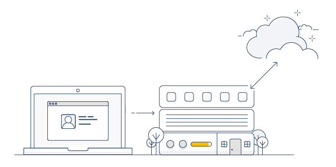

# Verify Access + Verify SaaS integration
[Verify SaaS](http://www.ibm.com/security/identity-access-management/cloud-identity) is the SaaS IBM offering that supports several multi-factor authentication types including IBM Verify. One advantage of leveraging authentication methods from the cloud is that the methods can be updated with newer technology more rapidly, and new methods can be adopted without the need for an IBM Security Verify Access update.

A second advantage is that Verify SaaS supplies both an email gateway and an SMS gateway, for SMS and Email OTP methods.



The Verify SaaS authentication types can be leveraged from Verify Access. Instead of redirecting users to Verify SaaS to perform authentication the Verify SaaS API integration within Verify Access can be used, starting at ISAM 9.0.5. This allows for complete control over the look and feel of the authentication experience.

The API Integration is achieved through a series of Info Map rules as well as a new Authentication Mechanism type - Cloud Identity JavaScript. The new mechanism type is very similar to an Info Map mechanism, with a few extra properties.

### What is in this repo?

#### Mapping Rules
Update the out of the box mapping rules on Verify Access (AAC > Global Settings > Mapping Rules) with the contents of the rules in [mapping_rules](/mapping_rules).

#### HTML templates
Upload the HTML files and CSS rules from [html](/html) to Verify Access via template files (AAC > Global Settings > Template Files).

### Applying updates for IBM Verify to 9.0.5

Some manual steps are required to enable the IBM Verify app on ISAM 9.0.5. Follow the steps [here](how_to_update_905) to update your ISAM 9.0.5 installation.

# License
```
Copyright 2018 International Business Machines

Licensed under the Apache License, Version 2.0 (the "License");
you may not use this file except in compliance with the License.
You may obtain a copy of the License at

    http://www.apache.org/licenses/LICENSE-2.0

Unless required by applicable law or agreed to in writing, software
distributed under the License is distributed on an "AS IS" BASIS,
WITHOUT WARRANTIES OR CONDITIONS OF ANY KIND, either express or implied.
See the License for the specific language governing permissions and
limitations under the License.
```
